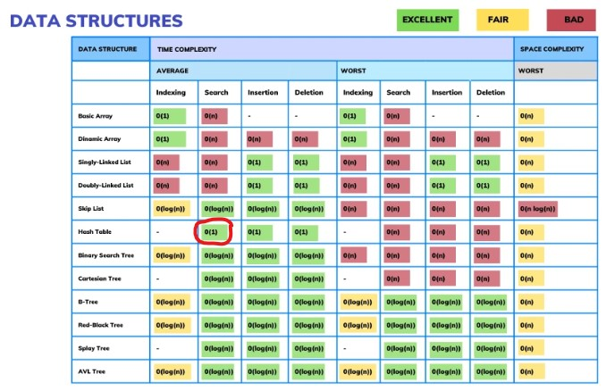
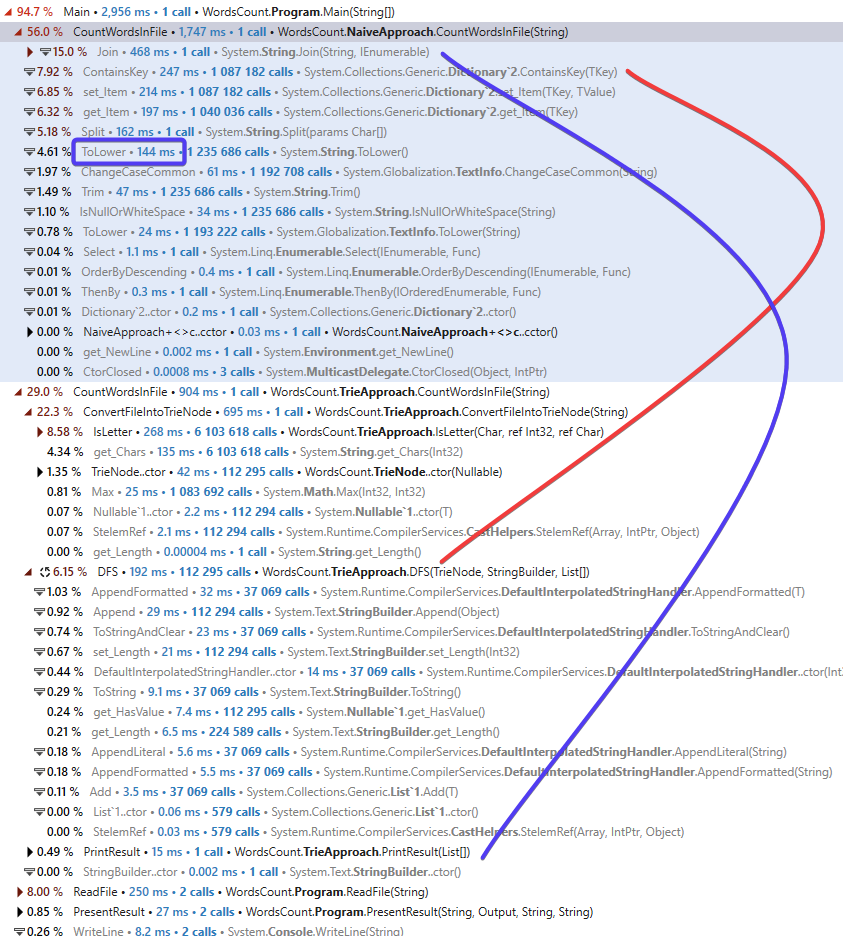
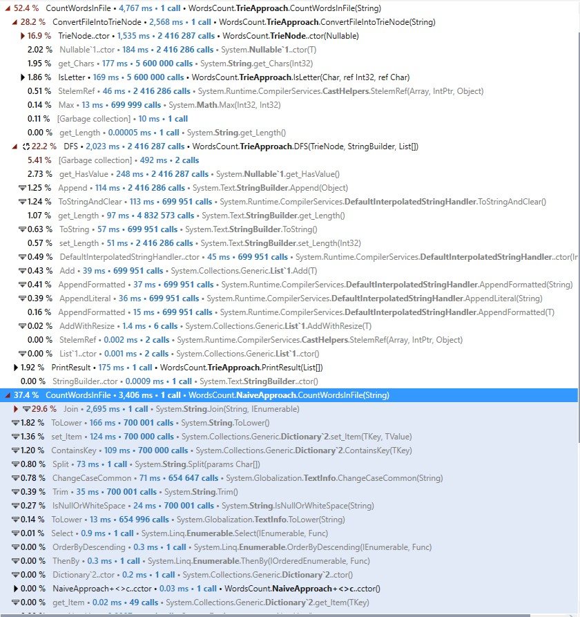

# Count words

It is generally accepted fact that Search on HashTable is $O(1)$ operation 
However in reality it is not constant, and as collection get bigger time to search increases. Current project has a goal to test if we can beat the speed of search in collection by using Tries data structure.
 
 File **"6MB_ManyBooks.txt"** contains about 6 MB of real books data which 2 algorithms will use to count words
 On figure below you can see Tries data structure could beat Dictionary collection and algorithm runs twice faster.
 

On a synthetic test however, "Naive" approach won due to high number of nodes needed to be created and Garbage collector took significant amount of time:

